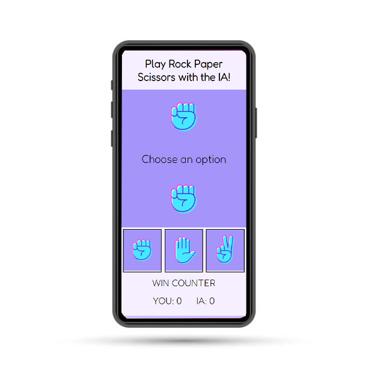

# Frontend Mentor - Rock, Paper, Scissors solution

This is a small game that I have made in Javascript Native. I hope you like it!

## Table of contents

- [Overview](#overview)
  - [Screenshot](#screenshot)
  - [Links](#links)
- [My process](#my-process)
  - [Built with](#built-with)
- [Author](#author)

## Overview

### Screenshot

### Links

- [Live Site URL](https://sgrinblat.github.io/rock-paper-scissors/)

## My process

### Built with

- JavaScript

## Author

- Linkedin - [Santiago Grinblat](https://www.linkedin.com/in/santiago-grinblat/)
